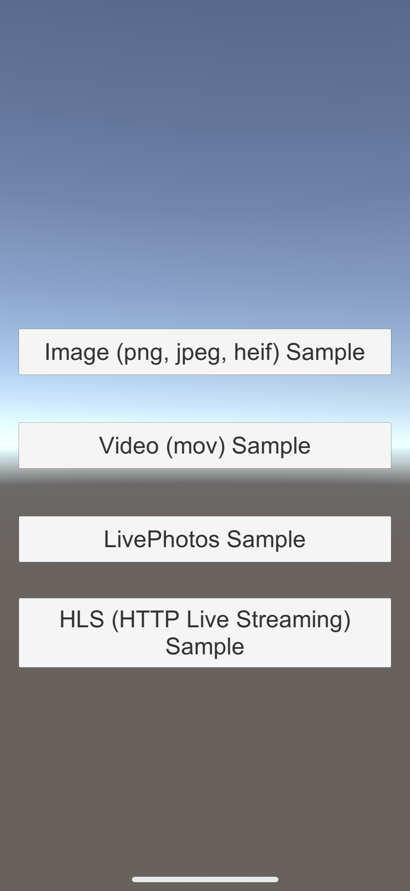
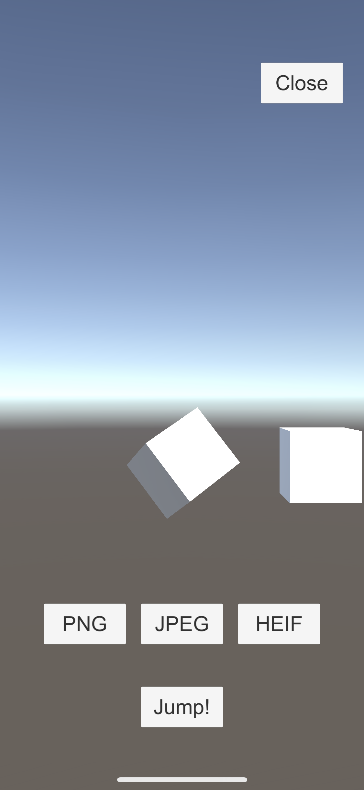
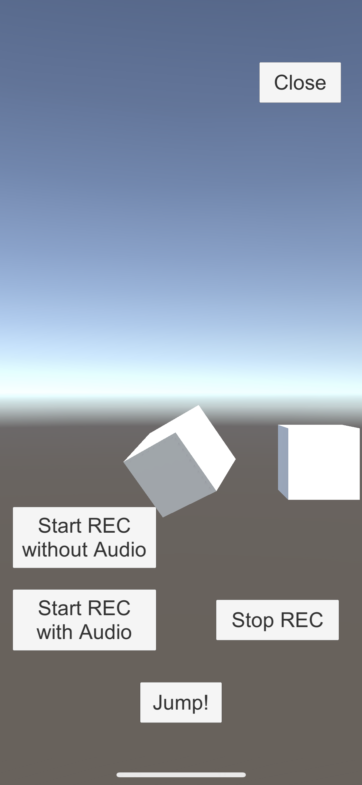
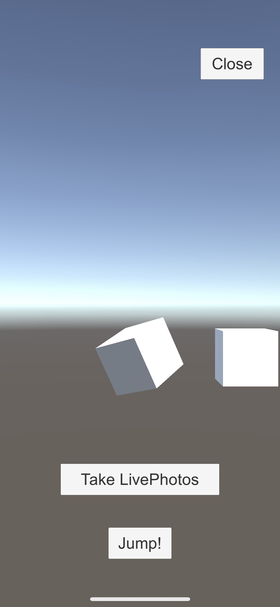
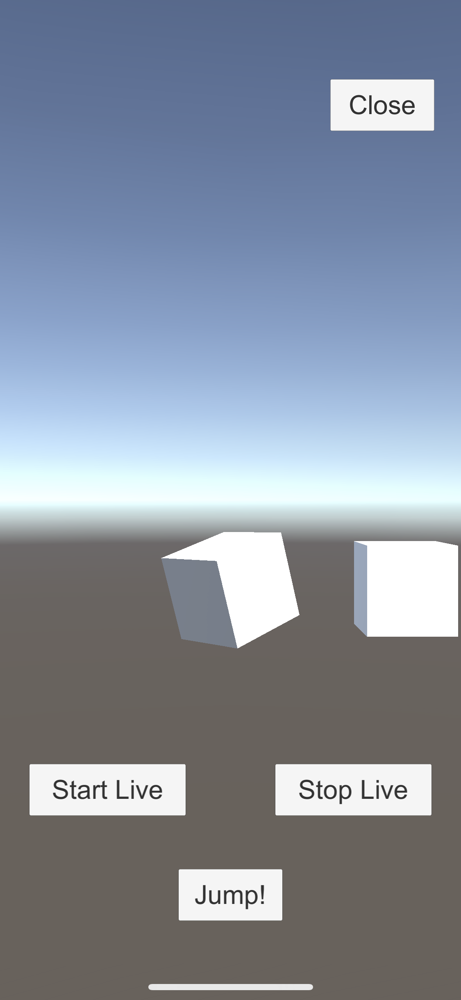

# UnityExample

* In the scene of the Unity sample project, there are two cameras placed.
* One is the Main Camera, and the other is the Recording Camera.
* The video from the main camera is displayed on the screen.
* Record the video from the recording camera and the audio from the microphone as a .mov file and save it to the Photos app.

## Main Scene

## Sample Scenes

# NativeExample
## MovExample
* Export Metal Texture & PCM data to movie file.

## HlsExample
* Stream Metal Texture as HLS.

## LivePhotosExample
* Save Metal Texture & PCM data as Live Photos.

